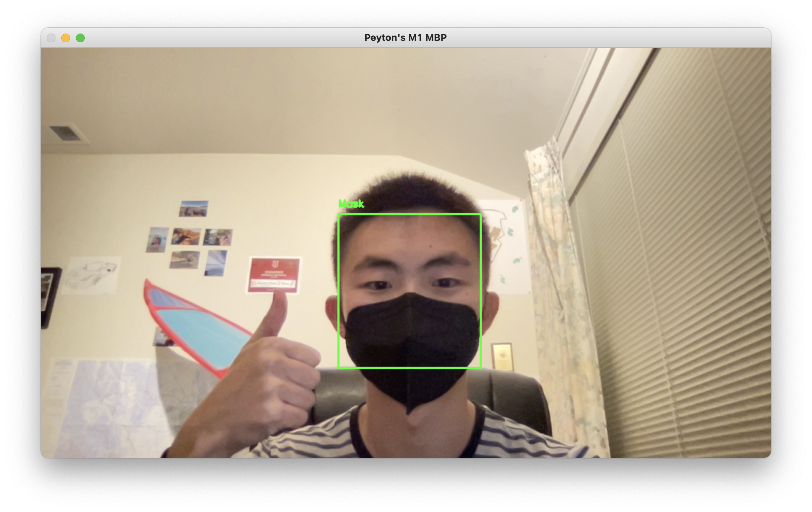

### CS 131 Demo Day Fall 2021

Peyton Chen

For CS 131 Demo Day, I decided to take inspiration from HW #8 and use PyTorch to implement a face mask detector. I found a dataset from Kaggle at this link: https://www.kaggle.com/ashishjangra27/face-mask-12k-images-dataset which contained 10,000 training images, 10,000 test images, and 800 validation images. This dataset has been invaluable in letting me train my convolutional neural network. Much of the scaffolding code resembled HW #8, however, I tailored the transforms to this specific dataset with still normalizing 0.5 mean and 0.5 standard deviation, but opting to resize all images to 150x150 so that the input was of a predictable size before training and inference.

For the actual neural network, I opted for the following architecture: 1 Conv2d layer, with input channels as 3 (since all the images I pass in I plan to be colored) and output channels as 32 with a kernel size of 3. I then had 2 more Conv2d layers with input channels as 32 and output channels as 32 and kernel size of 3. Application of these filters allowed the neural network to effectively gather a map of activations, indicating the locations and strength of what a face looks like with and without a mask. The RELU activation function is applied after each convolutional layer. I use MaxPool after each convolutional + RELU layer in order to reduce the size of each feature map to summarize the features detected in the input image. After this, I flatten the input with a `nn.Flatten()` layer before preceding to fully-connected layers of 512 to 100 and 100 to 1 (as we are just detecting whether someone is wearing a mask or not). I use RELU activation function here as well but add in a dropout layer of 0.5 between the two layers to prevent overfitting. Then, I apply the sigmoid function as we want to generate a probability prediction. To turn this into a label of 0 or 1, I just apply `torch.round()`. 

For the optimizer, I use the Adam optimizer because I wanted a computationally efficient optimizer as well as an algorithm that was appropriate for problems with noisy/sparse gradients. I left learning rate and other options as default. As this is a binary classification problem, I opted for a binary cross-entropy loss. I trained for 5 epochs which resulted in 99.37% accuracy on the test set of 10,000 images and 98.62% accuracy on the validation set with 800 images. I then, decided to use me as a test subject by taking an (awkward) selfie and it correctly classified me.

Finally, I decided to take this one step forward by implementing a program to harness the webcam of a user's computer to do live mask detection. I used `imutils` and `cv2` in order to do this. I also used a pre-trained model with weights for the face-detection algorithm (deploy.prototxt with SSD.caffemodel weights). Then, I configured the face detection with the appropriate hyperparameters and passed in every cropped face from the face-detection model to my pretrained CNN. The program stops when the user presses the character q while focused on the frame of the program. One observation I had for my model in "real-life" usage was that the model struggled a bit with dimly lit images/videos. As such, I found much better accuracy when I was in a well-lit room and my face was not in a shadow, which makes sense.

Here's a screenshot of the live-detection program.

To run training, look at `train.ipynb`. To run the live detection model, use `python3 live_detection.py`. This project was developed in Python 3.8.5 with PyTorch and OpenCV and miscellaneous other dependencies in a Miniconda environment on a M1 Macbook Pro.